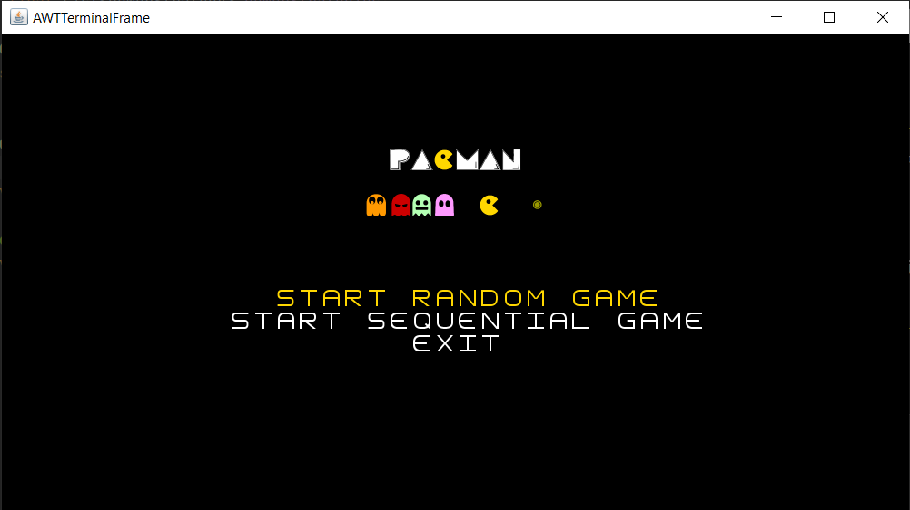

# *PAC-MAN V2* (in java)

Projeto é um jogo baseado em texto desenvolvido com recurso ao Lanterna para o desenho e interação com o mesmo, tendo especial atenção à sua organização.
Baseado no original Pac-man.

## Main Idea

O Pac-man tem como missão coletar todas as moedas do nível sem antes ser derrotado pelos fantasmas desse nível.

## Features

### 1. Diferentes Fantasmas
Existem diferentes fantasmas cujo tipo determina como estes atacam o nível. Para além disso cada tipo de fantasma define igualmente o seu modo de movimento.

### 2. Diferentes PowerUps
Existem variados bónus que também podem ser coletados pelo Pac-man podendo ajuda-lo a terminar mais facilmente o nível. Estes tanto podem afetar o próprio Pac-man como os fantasmas.

### 3. Chaves e Portas
Um nível pode ainda ser constituído por "zonas restritas", ou seja, zonas que só podem ser acedidas após coletar a chave correspondente à porta (identificada pelo seu desenho com a mesma cor).

### 4. Leitura de Mapas por ficheiros
É possível criar o mapa a partir de um ficheiro, isto permitirá ter múltiplos mapas de forma organizada, acessível e facilmente manipuláveis:
  - \# parede
  - o moeda
  - P Pac-man
  - G *Killer Ghost*
  - C *Reset Coins Ghost*
  - S *Reduce Score Ghost*
  - L *Eliminate Power Ups Ghost*
  - K chave (key)
  - D porta (door)
  - H cereja (cherry)
  - A maça (apple)
  - O laranja (orange)
  - E pera (pear)

## Final Result

### 1. Simulação de jogo

### 2. Estados do jogo

  

  

  

