# LPOO_75 - *Pac-man V2*

O objetivo do projeto é criar um jogo baseado em texto que recorra ao Lanterna para o desenho e interação com o mesmo, tendo especial atenção à sua organização. Neste sentido é valorizado e tido como alvo a não violação dos **princípios SOLID**, utilização correta de **Design Patterns**, identificação de **Code Smells** e sua resolução recorrendo a  **Refractoring Methods**, teste de todas as componentes com **Unit Testing** (operando com **Mocks** e **Stubs** sempre que necessário) e apresentar um padrão de arquitetura de **MVC (Model-View-Controller)**.

O nosso jogo é inspirado no original "Pac-man", onde a personagem principal, o Pac-man, tem como missão coletar todas as moedas do nível sem antes ser derrotado pelos fantasmas desse nível. Na nossa versão existem diferentes fantasmas cujo tipo determina como estes influenciam um nível. Para além disso cada tipo de fantasma define igualmente o seu modo de movimento. Da mesma forma, existem variados bónus (*power ups*) que também podem ser coletados pelo Pac-man podendo ajuda-lo a terminar mais facilmente o nível. Estes tanto podem afetar o próprio Pac-man como os fantasmas. Um nível pode ainda ser constituído por "zonas restritas", ou seja, zonas que só podem ser acedidas após coletar a chave correspondente à porta (identificada pelo seu desenho com a mesma cor).

Este projeto foi desenvolvido por Marta Mariz (up201907020@up.pt), Patrícia Oliveira (up201905427@up.pt) e Telmo Botelho (up201806821@up.pt) para a Unidade Curricular LPOO 2020/2021.

***

## Implemented Features:

- **Leitura de mapas** - Os mapas dos níveis podem ser lidos a partir de ficheiros ou criados de forma aleatória (não incluindo este último método portas e chaves);

- **Níveis Aleatórios** - Níveis gerados com um determinado número de moedas, fantasmas e *power ups* em posições aleatórias.

- **Níveis Sequenciais** - Níveis gerados a partir de ficheiros, onde vencer um nível nos leva para o seguinte, mas perder qualquer nível faz com que se tenha de recomeçar a sequência desde nível 1.

- **Componentes do Mapa** - Num nível podem ser encontrados os possíveis elementos: paredes, moedas, o Pac-man, fantasmas, *power ups*, chaves e portas. Paredes, moedas *power ups*, chaves e portas são elementos fixos no nível, ou seja cuja posição nunca é alterada, e entre estes podemos distinguir as moedas, chaves e *power ups* como elementos coletáveis, enquanto o Pac-man e fantasmas são elementos que se movem no nível;

- **Movimento do Pac-man** - O Pac-man apenas se move ao reconhecer que o utilizador premir uma tecla com essa indicação, sendo as opções possíveis: *RIGHT*, *LEFT*, *UP*, *DOWN*.

- **Colisões do Pac-man** - O Pac-man não pode ultrapassar paredes nem portas que ainda estejam fechadas. Quando colide com uma moeda recolhe-a (aumentando o valor do seu score em conformidade). Quando colide com uma chave abre todas as portas associadas a esta. Quando colide com um *power up* ativa o seu respetivo poder. E quando colide com um fantasma é atacado por este como descrito dois pontos abaixo;

- **Continuidade do mapa** - O Pac-man e os fantasmas podem ser teletransportados de uma borda do mapa para a borda oposta. Mecanismo implementado na horizontal e vertical;

- **Ataques dos Fantasmas** - Existem 4 tipos de fantasmas que influenciam o nível de formas diferentes (apenas atacam quando e só quando colidem com o Pac-man):
  - *Killer Ghost*: retira uma vida ao Pac-man;
  - *Reset Coins Ghost*: reinicia todas as moedas do nível, inicializando o score do jogador a 0 se este for positivo;
  - *Reduce Score Ghost*: diminui a pontuação do Pac-man por um valor de 30, por defeito;
  - *Eliminate Power Ups Ghost*: elimina todos os *power ups* do nível.

- **Movimentos dos Fantasmas** - Os fantasmas movem-se entre intervalos de tempo determinados (desde que não esteja paralisado), independentemente do movimento do Pac-man e de outros fantasmas. Cada tipo de fantasma move-se no nível de forma determinista (não podendo em nenhum caso ultrapassar paredes ou portas fechadas):
  - *Killer Ghost*: move-se aleatoriamente para uma das casas vizinhas;
  - *Reset Coins Ghost*: move-se apenas horizontalmente;
  - *Reduce Score Ghost*: move-se apenas verticalmente;
  - *Eliminate Power Ups Ghost*: move-se aleatoriamente para uma das casas vizinhas.

  ***NOTA***: no movimento horizontal e vertical a inversão do sentido é um evento determinado aleatoriamente, sendo que em cada momento estes tem a mesma probabilidade de escolher continuar na mesma direção ou avançar na direção oposta.

- **Poderes dos Power Ups** - Existem 4 tipos de *power ups* com diferentes poderes:
  - *Cherry*: adiciona uma vida ao Pac-man;
  - *Apple*: aumenta a pontuação do Pac-man por um valor de 50, por defeito;
  - *Orange*: paralisa todos os fantasmas do nível;
  - *Pear*: combina os poderes de todos os bónus anteriores (super bónus).

  ***NOTA***: Quando um fantasma é paralisado quando já se encontrava nesse estado o seu tempo de paralisia é adicionado ao que ainda restava.

- **Zonas fechadas** - É necessário coletar uma chave para desbloquear a(s) porta(s) respetiva(s).

- **Menus** - Existem diferentes menus que nos permitem navegar entre diferentes estados do jogo:
  - *Menu Principal*: onde se inicia o jogo e permite **sair** do jogo ou selecionar o tipo de jogo: **Nível aleatório** ou **Sequência de Níveis**;
  - *Menu de Pausa*: sempre que a meio de um nível se pressiona a tecla 'Q' e permite **voltar** ao menu principal (perdendo qualquer progresso naquele nível), **continuar** ou **reiniciar** o mesmo nível;
  - *Menu de Nível Vencido*: quando se completa um nível (todas as moedas foram coletadas), dando as opções de **continuar** para o seguinte (no caso da sequência de níveis), **voltar** ao menu principal ou **sair** do jogo (mostrando uma mensagem diferente quando se termina todos os níveis do jogo);
  - *Menu de Nível Perdido*: quando se perde um nível (Pac-man fica sem vidas), dando as opções de **tentar outra vez**, **voltar** ao menu principal ou **sair** do jogo.

  ***NOTA***: É ainda apresentado, em conjunto com as opções que podem ser selecionadas, algumas informações relativas ao nível em questão, como por exemplo: número de vidas do Pac-man, pontuação ou número do nível, conforme o que faça sentido em cada menu.

- **Terminal do jogo** - Todos os componentes do jogo são desenhados com uma fonte criada e gerada para os efeitos do jogo. O desenho recorre a um *Screen* do Lanterna.

- **Desenho dos Fantasmas** - Cada fantasma tem uma cor e imagem característica no nível (determinada na concretização da GUI com o Lanterna):
  - *Killer Ghost*: Vermelho;
  - *Reset Coins Ghost*: Cor-de-rosa;
  - *Reduce Score Ghost*: Verde claro;
  - *Eliminate Power Ups Ghost*: Laranja.

- **Desenho das portas e chaves** - As portas são desenhadas da mesma cor da chave que as abrem.

| Mapa do Nível (em ficheiro) | Simulação do jogo do nível (com Lanterna) |
|  :----: |  :----: |
| 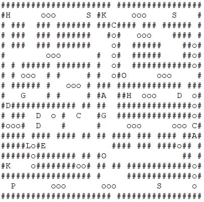 | 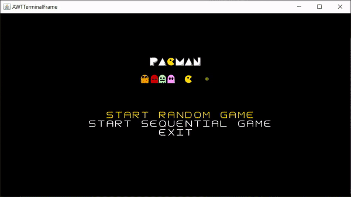 |

***NOTA***: Por cada nível para além do ficheiro do mapa é necessário ter um ficheiro auxiliar com a informação do valor das moedas desse nível e associação de chaves a respetivas portas, caso existam. O formato é o seguinte (exemplo do nível simulado acima):

  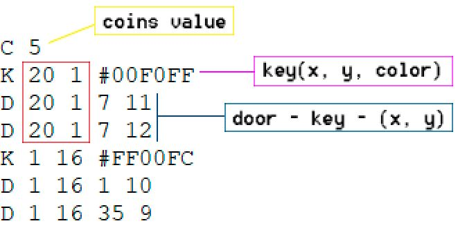

As portas que são desbloqueadas por cada uma das chaves são identificadas pela repetição da posição da chave correspondente como se destaca no retângulo vermelho.

***

## Design

No planeamento inerente ao desenvolvimento do projeto foram discutidos e pensados os seguintes padrões para as funcionalidades listadas:

| Problema                                                             | Design Pattern         |
| :---                                                                 |          :----:        |
| Modelo Arquitetural (requisito)                                      | MVC                    |
| Diferentes formas de construir o mapa                                | Builder pattern        |
| Tipos de movimento dos fantasmas                                     | Strategy pattern       |
| Diferentes efeitos do ataque dos fantasmas                           | Strategy pattern       |
| Cada fantasma define o seu modo de movimento e estratégia de ataque  | Factory-Method pattern |
| Definição dos efeitos dos bónus no nível                             | Strategy pattern       |
| Cada bónus define o seu poder                                        | Factory-Method pattern |
| Fantasmas no estado normal ou paralisado                             | State pattern          |
| O poder de um bónus é o conjunto de outros poderes                   | Composite pattern      |
| Uma porta abre quando a respetiva chave é coletada                   | Observer pattern       |
| Variados estados de jogo e interação entre menus                     | State pattern          |

***

### 1. Model-View-Controller

  #### Problem in Context:
  Um dos requisitos do projeto era aplicar o padrão arquitetural **Model-View-Controller**. Tal escolha permite mais facilmente garantir que o **Single Responsability Principle** não será violado, pelo que cada classe terá a sua responsabilidade bem definida.

  #### The Pattern: **MVC**

  >MVC consists of three kinds of objects. The Model is the application object, the View is its screen presentation, and the Controller defines the way the user interface reacts to user input.
  >
  >GoF, Design Patterns - Elements of Reusable Object-Oriented Software

  

    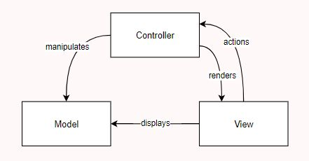
  

  Este padrão arquitetural é habitualmente usado para desenvolver programas onde é implementada uma interface para o utilizador e consiste em dividir uma aplicação em 3 partes:
  - **Model**: representa os dados do programa.
  - **View**: mostra os dados do **Model** e manda as ações do utilizador para o **Controller**.
  - **Controller**: fornece dados do **Model** à **View** e interpreta as ações do utilizador.

  #### Implementation
  A estrutura do código está dividida de forma a haver 3 packages principais, cada package referente a um ponto do MVC e uma classe Game que serve como executável e que contém o método main(). Cada package de MVC tem dentro as classes referentes ao seu perfil.

  

    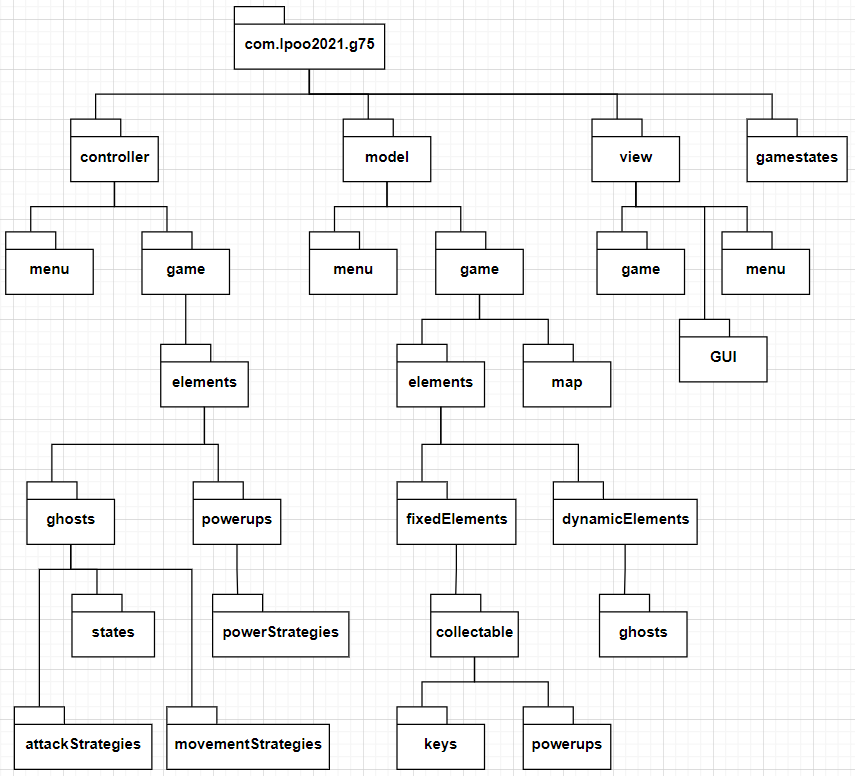
  

  #### Consequences
  - Divisão e organização do código por *packages*;
  - Independência entre módulos possibilita testar cada parte do MVC individualmente;
  - O *Model* é independente do *Controller* e da *View*;
  - Possibilidade de alterar o modo de visualização do jogo (GUI) sem ter de modificar o *Model* ou a lógica de jogo - singularidade.

***

### 2. Construtor de Mapas

  #### Problem in Context:
  Um mapa de um nível é composto por vários componentes. Mas como é que estes serão criados? De forma totalmente aleatória, a partir de um ficheiro, com apenas alguns dos componentes, a partir de uma base de dados? De facto, um nível deverá poder ser construído de diferentes formas passo a passo, e o seu método de construção não pode afetar o restante funcionamento do jogo. Neste sentido decidimos usar o **Builder Pattern**.

  #### The Pattern: **Builder Pattern**

  >Builder is a creational design pattern that lets you construct complex objects step by step. The pattern allows you to produce different types and representations of an object using the same construction code.
  >
  >Refactoring Guru, Design Patterns, Creational Patterns - Builer Pattern

  Ao dividir a construção do mapa pela construção individual de cada um dos seus componentes permite-nos ter diversos mecanismos para a criação dos mesmos independentes uns dos outros e que podem ter igualmente por base diversas fontes para essa informação. Tal resolve o problema apresentado.

  #### Implementation

  De forma a implementar este padrão o mapa deixa de saber como se construi apenas sabe quais os elementos pelo qual pode ser composto e qual o construtor que o vai gerar. Por outro lado, os variados construtores sabem como gerar cada um dos componentes individualmente e todos partilham os métodos comuns a um construtor (interface).

  

    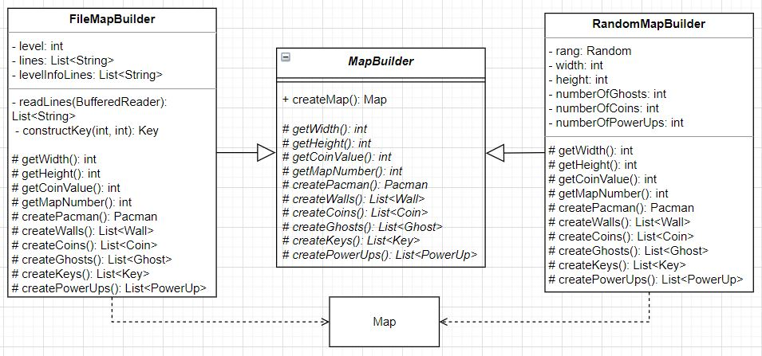
  

  - [MapBuilder](https://github.com/FEUP-LPOO-2021/lpoo-2021-g75/blob/07d74f0657f0d862540a3aae4dd6ce6e73db18f0/src/main/java/com/lpoo2021/g75/model/game/map/MapBuilder.java)
  - [RadomMapBuilder](https://github.com/FEUP-LPOO-2021/lpoo-2021-g75/blob/07d74f0657f0d862540a3aae4dd6ce6e73db18f0/src/main/java/com/lpoo2021/g75/model/game/map/RandomMapBuilder.java)
  - [FileMapBuilder](https://github.com/FEUP-LPOO-2021/lpoo-2021-g75/blob/07d74f0657f0d862540a3aae4dd6ce6e73db18f0/src/main/java/com/lpoo2021/g75/model/game/map/FileMapBuilder.java)

  #### Consequences
  - Maior flexibilidade de criação de mapas;
  - Fácil expansão de construtores (por exemplo DatabaseMapBuilder) - O ***Open/Cloded Principle*** é obedecido;
  - Divisão mais clara de responsabilidades (o mapa não tem de saber como se criar a ele próprio) - O ***Single Responsability Principle*** é obedecido.

***

### 3. Tipos de Movimentos, Ataques e Poderes

  #### Problem in Context:
  Para que possam existir diferentes tipos de ataques, poderes e movimentos. Diferindo entre si exatamente na forma como afetam um nível e no modo de como decidem a sua próxima posição, respetivamente. Estes tipos de estratégias são deterministas. Com isto em mente decidimos aplicar o **Strategy Pattern**.

  #### The Pattern: **Strategy Pattern**
  Este padrão comportamental deixa-nos definir uma família de algoritmos distintos para resolver um dado problema, sendo que cada algoritmo corresponde a uma classe diferente. Estes algoritmos são a instanciação do diferente tipo de estratégia que queremos adotar pelo mesmo. Assim é possível resolver o problema de existirem diferentes estratégias de movimentos, ataques e poderes e não deixarem de ser reconhecidos como uma estratégia de movimento, ataque ou poder, respetivamente.

  #### Implementation
  Em seguida é demonstrada a sua implementação por um UML para o caso dos fantasmas (tipos de **movimentos** e **ataques**). Tal procedimento é replicado para as estratégias de poder dos *power ups*.

  

    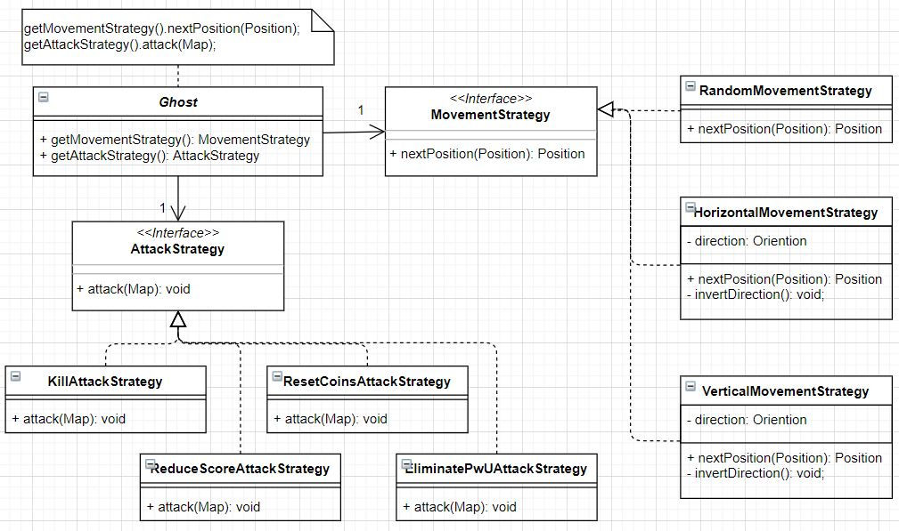
  

  - [MovementStrategy](https://github.com/FEUP-LPOO-2021/lpoo-2021-g75/blob/be93f4f870ad749189e23b874c25c01a69e203ac/src/main/java/com/lpoo2021/g75/controller/ghosts/MovementStrategy.java)
    - [HorizontalMovementStrategy](https://github.com/FEUP-LPOO-2021/lpoo-2021-g75/blob/be93f4f870ad749189e23b874c25c01a69e203ac/src/main/java/com/lpoo2021/g75/controller/ghosts/movementStrategies/HorizontalMovementStrategy.java) -
    [VerticalMovementStrategy](https://github.com/FEUP-LPOO-2021/lpoo-2021-g75/blob/be93f4f870ad749189e23b874c25c01a69e203ac/src/main/java/com/lpoo2021/g75/controller/ghosts/movementStrategies/VerticalMovementStrategy.java)  -
    [RandomMovementStrategy](https://github.com/FEUP-LPOO-2021/lpoo-2021-g75/blob/be93f4f870ad749189e23b874c25c01a69e203ac/src/main/java/com/lpoo2021/g75/controller/ghosts/movementStrategies/RandomMovementStrategy.java)

  - [AttackStrategy](https://github.com/FEUP-LPOO-2021/lpoo-2021-g75/blob/be93f4f870ad749189e23b874c25c01a69e203ac/src/main/java/com/lpoo2021/g75/controller/ghosts/AttackStrategy.java)
    - [KillAttackStrategy](https://github.com/FEUP-LPOO-2021/lpoo-2021-g75/blob/be93f4f870ad749189e23b874c25c01a69e203ac/src/main/java/com/lpoo2021/g75/controller/ghosts/attackStrategies/KillAttackStrategy.java) -
    [ResetCoinsAttackStrategy](https://github.com/FEUP-LPOO-2021/lpoo-2021-g75/blob/07d74f0657f0d862540a3aae4dd6ce6e73db18f0/src/main/java/com/lpoo2021/g75/controller/game/elements/ghosts/attackStrategies/ResetCoinsAttackStrategy.java) -
    [ReduceScoreAttackStrategy](https://github.com/FEUP-LPOO-2021/lpoo-2021-g75/blob/be93f4f870ad749189e23b874c25c01a69e203ac/src/main/java/com/lpoo2021/g75/controller/ghosts/attackStrategies/ReduceScoreAttackStrategy.java) -
    [EliminatePwUAttackStrategy](https://github.com/FEUP-LPOO-2021/lpoo-2021-g75/blob/07d74f0657f0d862540a3aae4dd6ce6e73db18f0/src/main/java/com/lpoo2021/g75/controller/game/elements/ghosts/attackStrategies/EliminatePwUAttackStrategy.java)

  - [PowerStrategy](https://github.com/FEUP-LPOO-2021/lpoo-2021-g75/blob/07d74f0657f0d862540a3aae4dd6ce6e73db18f0/src/main/java/com/lpoo2021/g75/controller/game/elements/powerUps/PowerStrategy.java)
    - [AddLivePowerStrategy](https://github.com/FEUP-LPOO-2021/lpoo-2021-g75/blob/07d74f0657f0d862540a3aae4dd6ce6e73db18f0/src/main/java/com/lpoo2021/g75/controller/game/elements/powerUps/powerStrategies/AddLivePowerStrategy.java) -
    [IncreaseScorePowerStrategy](https://github.com/FEUP-LPOO-2021/lpoo-2021-g75/blob/07d74f0657f0d862540a3aae4dd6ce6e73db18f0/src/main/java/com/lpoo2021/g75/controller/game/elements/powerUps/powerStrategies/IncreaseScorePowerStrategy.java) -
    [ParalyzeGhostPowerStrategy](https://github.com/FEUP-LPOO-2021/lpoo-2021-g75/blob/07d74f0657f0d862540a3aae4dd6ce6e73db18f0/src/main/java/com/lpoo2021/g75/controller/game/elements/powerUps/powerStrategies/ParalyzeGhostPowerStrategy.java) -
    [CombinePowerStrategy](https://github.com/FEUP-LPOO-2021/lpoo-2021-g75/blob/07d74f0657f0d862540a3aae4dd6ce6e73db18f0/src/main/java/com/lpoo2021/g75/controller/game/elements/powerUps/powerStrategies/CombinePowerStrategy.java)

  #### Consequences
  - Isolação da implementação de cada algoritmo de movimento, ataque e poder. - O ***Open/Closed Principle*** é obedecido, facilmente são adicionadas/alteradas estratégias específicas sem afetar o restante projeto.
  - Torna-se possível alterar a estratégia que um dado elemento usa em runtime (não aplicável ao nosso projeto, mas poderá ser usado no futuro).

***

### 4. Fantasma tem o seu próprio Movimento e Ataque; Power up determina o seu Poder

  #### Problem in Context:
  Existem 4 tipos de fantasmas e cada um com a sua própria "personalidade". Isto é, o seu tipo define como este ataca e se move no nível (explicado na secção *Implemented Features*). Existem, igualmente, 4 bónus diferentes cada um com o seu respetivo poder.
  Nesta perspetiva, e visto que tais características não são alteradas em tempo de execução, recorremos ao **Factory-Method Pattern**.

  #### The Pattern: **Factory-Method Pattern**

  > Factory Method is a creational design pattern that provides an interface for creating objects in a superclass, but allows subclasses to alter the type of objects that will be created.
  >
  >Refactoring Guru, Design Patterns, Creational Patterns - Factory-Method Pattern

  Desta forma a decisão das estratégias que cada fantasma quer adotar para se mover e atacar é inerente a ele próprio e em nada afeta a forma como se interage com qualquer tipo de fantasma. Da mesma forma, que a escolha do poder de cada um dos diferentes *power ups* é realizada pelo próprio e a interação com estes não difere de acordo com a estratégia implementada. Assim, resolve-se o problema anteriormente enunciado.

  #### Implementation
  Cada instância de fantasma cria e retorna o seu próprio movimento e ataque. Cada instância de *power up* cria e retorna o seu próprio poder. Estes métodos são chamados aquando a criação de qualquer fantasma ou *power up* pelo construtor da classe de quem estes derivam.

  O seguinte UML representa o raciocínio explicado posteriormente para um único tipo de fantasma *KillerGhost*. O mecanismo demostrado é efetivamente aplicado a todos os tipos de fantasmas diferindo apenas na estratégia concreta que é criada por cada um, de acordo com as especificidades do mesmo indicadas na secção "Implemented features".
  Este mecanismo e pensamento é replicado para os *power ups*, mas com estratégias de poder.

  

    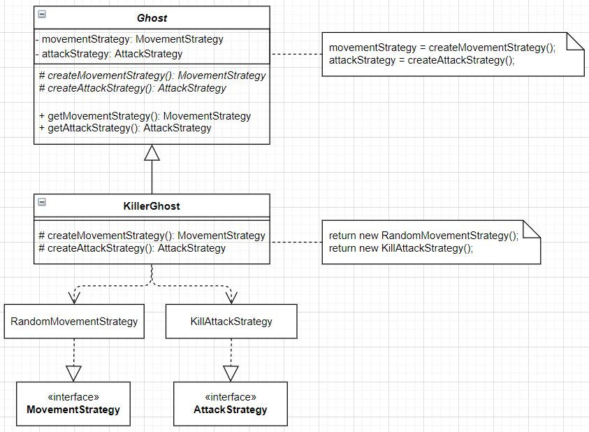
  

  A interação e manipulação de todos os fantasmas ou *power ups* fica facilitada e não depende da estratégia que um tipo específico usa para atacar ou mover ou empoderar.

  ~~~java
  @Override
  public void step(Map map) {
      moveGhost(map, ghost.getMovementStrategy().nextPosition(ghost.getPosition()));
  }

  private void moveGhost(Map map, Position position) {
      position = map.teleport(position);

      if (map.isEmpty(position)) {
          ghost.setPosition(position);
          if (map.getPacman().getPosition().equals(position))
              this.attack(map);
      }
  }

  @Override
  public void attack(Map map) {
      ghost.getAttackStrategy().attack(map);
  }
  ~~~

  ~~~java
  private void movePacman(Position position) {
      position = getModel().teleport(position);

      if (getModel().isEmpty(position)) {
          getModel().getPacman().setPosition(position);

          (...)

          if (getModel().isPowerUp(position))
              getModel().collectPowerUp(position).getPowerStrategy().power(getModel());
      }
  }
  ~~~

  #### Consequences
  - Possível gerar várias combinações de fantasmas que usam estratégias de ataque e movimento diferentes;
  - Cada fantasma apenas sabe que tem formas de atacar e mover mas não se precisa de preocupar como;
  - Possível gerar diferentes *power ups* que usam específicas estratégias de poder;
  - Cada *power ups* apenas sabe que tem formas de usar o seu poder mas não se precisa de preocupar como.

***

### 5. Estados dos Fantasmas

  #### Problem in Context:
  Um dos poderes para um *power up* é paralisar os fantasmas de um nível. Tal se refletirá no seu movimento e ataque, uma vez que os fantasmas quando paralisados não atacam sem se movimentam. Assim, o fantasma poderá encontrar-se em 2 estados: **Normal** e **Paralisado**. Uma vez paralisado um fantasma deixa de estar paralisado após 5 segundos, e caso seja novamente paralisado quando já se encontrava nesse estado estes 5 segundos são adicionados ao tempo que ainda lhe faltava da anterior paralisia.
  De forma a resolver este problema recorremos ao **State Pattern**.

  #### The Pattern: **State Pattern**

  > State is a behavioral design pattern that lets an object alter its behavior when its internal state changes. It appears as if the object changed its class.
  >
  >Refactoring Guru, Design Patterns, Behavioral Patterns - State Pattern

  O uso deste padrão permitirá, então, alterar entre estes estados tendo em conta diferentes transições predefinidas.

  #### Implementation
  Existem dois estados que o fantasma pode tomar: *NormalGhostState* e *ParalyzeGhostState*, sendo que as transições entre estes são apenas determinadas por eles próprios. Ou seja, um fantasma passa a ter conhecimento do estado onde se encontra e é com base neste que se move, ataca, paralisa ou reconhece que já passou tempo e age em conformidade para o estado seguinte.

  A seguinte máquina de estados exemplifica os diferentes estados possíveis e todas as transições entre estes.

  

    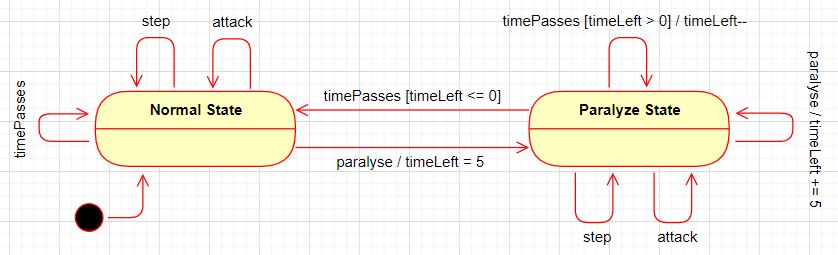
  

  Como agir perante uma determinada ação ou transição fica a cargo e é inerente a cada estado. Para além de os fantasmas serem inicialmente criados no seu estado normal, nada para além dos próprios estados pode alterar diretamente este seu estado.

  ~~~java
  private void movePacman(Position position) {
      position = getModel().teleport(position);

      if (getModel().isEmpty(position)) {
          getModel().getPacman().setPosition(position);

          if (getModel().isGhost(position))
              getModel().getGhost(position).getState().attack(getModel());

          (...)
      }
  }
  ~~~

  ~~~java
  public class ParalyzeGhostPowerStrategy implements PowerStrategy {
      @Override
      public void power(Map map) {
          for (Ghost ghost : map.getGhosts()) {
              ghost.getState().paralyze();
          }
      }
  }
  ~~~

  - [GhostState](https://github.com/FEUP-LPOO-2021/lpoo-2021-g75/blob/07d74f0657f0d862540a3aae4dd6ce6e73db18f0/src/main/java/com/lpoo2021/g75/controller/game/elements/ghosts/GhostState.java)
    - [NormalGhostState](https://github.com/FEUP-LPOO-2021/lpoo-2021-g75/blob/07d74f0657f0d862540a3aae4dd6ce6e73db18f0/src/main/java/com/lpoo2021/g75/controller/game/elements/ghosts/states/NormalGhostState.java) -
    [ParalyzeGhostState](https://github.com/FEUP-LPOO-2021/lpoo-2021-g75/blob/07d74f0657f0d862540a3aae4dd6ce6e73db18f0/src/main/java/com/lpoo2021/g75/controller/game/elements/ghosts/states/ParalyzeGhostState.java)

  #### Consequences
  - Organizar o código relativo a estados específicos em classes separadas - ***Single Responsibility Principle***;
  - Possível introduzir novos estados sem modificar as classes dos estados que já existem ou o contexto dos mesmos - ***Open/Closed Principle***;
  - Simplifica o código ao eliminar condições complexas. Torna-se mais fácil perceber onde nos encontramos em cada estado e onde uma ação nos pode levar a partir daí.

***

### 6. Super poder (Poder se é a combinação de outros poderes)

  #### Problem in Context:
  Um super poder é um poder que engloba outros vários poderes, mas não deixa de ser visto como um poder. Nesta perspetiva, aplicamos o padrão **Composite Pattern**.

  #### The Pattern: **Composite Pattern**

  > Composite is a structural design pattern that lets you compose objects into tree structures and then work with these structures as if they were individual objects.
  >
  >Refactoring Guru, Design Patterns, Structural Patterns - Composite Pattern

  Desta forma, esta estratégia é vista como sendo um conjunto de outras estratégias e o seu poder corresponde a aplicar o poder de todas as que a compõem. No entanto, não deixa de ser uma estratégia de poder e a interação com esta é exatamente a mesma que se fosse uma estratégia simples. Permite até usar construir esta a partir outras do mesmo tipo.

  #### Implementation
  A *CombinePowerStrategy* tem associada uma lista de outras estratégias de poder e sempre é para usar o seu poder esta lista é percorrida e invoca-se o poder de todas as estratégias que a compõem, independentemente do tipo de poder que seja, pois tal como esta não deixa de ser uma estratégia de poder. Por defeito, esta lista equivale às outras 3 estratégias de poder do jogo.

  O seguinte UML pretende exemplificar exatamente este raciocínio.
  

    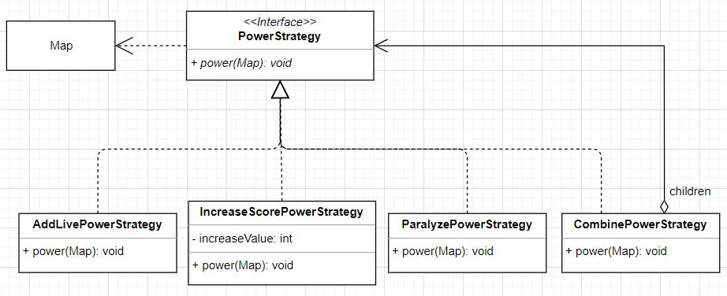
  

  ~~~java
  public class CombinePowerStrategy implements PowerStrategy {
      private final List<PowerStrategy> powerStrategies;

      public CombinePowerStrategy() {
          this.powerStrategies = Arrays.asList(new AddLivePowerStrategy(), new IncreaseScorePowerStrategy(), new ParalyzeGhostPowerStrategy());
      }

      public CombinePowerStrategy(List<PowerStrategy> powerStrategies) {
          this.powerStrategies = powerStrategies;
      }

      public void addPowerStrategy(PowerStrategy powerStrategy) {
          this.powerStrategies.add(powerStrategy);
      }

      @Override
      public void power(Map map) {
          for (PowerStrategy powerStrategy : powerStrategies)
              powerStrategy.power(map);
      }
  }
  ~~~

  A interação e manipulação de qualquer estratégia continua a ser a mesma, como de uma simples estratégia se tratasse [ver no ponto 4 o código *movePacman*, onde se ativa um poder independentemente da estratégia].

  #### Consequences
  - Possível introduzir mais estratégias de poder sem modificar esta - ***Open/Closed Principle***;
  - Facilita a manipulação desta árvore de poderes, usando o polimorfismo e recursão em nossa vantagem.

***

### 7. Coletar chave desbloqueia as suas portas

  #### Problem in Context:
  Existem portas que apenas são abertas quando as respetivas chaves são coletadas. Assim, uma porta precisa de ser notificada quando tal acontece para saber que então já foi desbloqueada.
  Com isto em mente implementamos o **Observer Pattern**.

  #### The Pattern: **Observer Pattern**

  > Observer is a behavioral design pattern that lets you define a subscription mechanism to notify multiple objects about any events that happen to the object they’re observing.
  >
  >Refactoring Guru, Design Patterns, Behavioral Patterns - Observer Pattern

  Desta forma, notificamos todas as portas que observam as chaves quando estas são recolhidas.

  #### Implementation
  Uma chave tem uma lista de observadores. Sempre que o método *collect* é invocado estas notificam todos os objetos que as observam e estes agem em conformidade. No caso, das portas quando recebem a notificação que a sua chave foi *collected* dizem a si próprias que então já não estão fechadas (representado por uma variável booleana). Num nível apenas são consideradas e desenhadas portas que estejam fechadas.

  O seguinte UML descreve o mecanismo de notificação usado.
  

    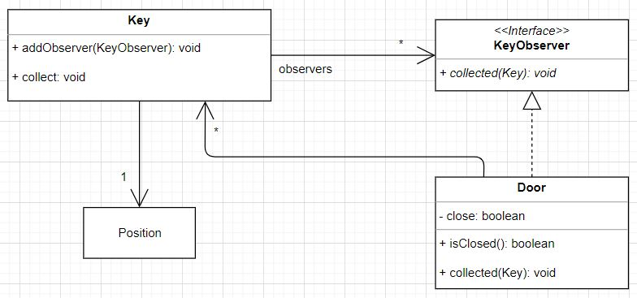
  

  ~~~java
  public class Key extends CollectableElement {
      private final List<KeyObserver> observers;

      (...)

      public List<KeyObserver> getObservers() {
          return this.observers;
      }

      public void addKeyObserver(KeyObserver observer) {
          this.observers.add(observer);
      }

      @Override
      public void collect() {
          this.collected = true;
          for (KeyObserver observer : observers)
              observer.collected(this);
      }
  }
  ~~~

  ~~~java
  public interface KeyObserver {
      void collected(Key key);
  }
  ~~~

  ~~~java
  public class Door extends FixedElement implements KeyObserver {
      private boolean close;

      (...)

      @Override
      public void collected(Key key) {
          this.close = false;
      }
  }
  ~~~

  #### Consequences
  - Aumenta a complexidade do projeto quando os únicos observadores das chaves são portas;
  - Possível introduzir novos observadores sem ter de alterar o código relativo às chaves - ***Open/Closed Principle***;
  - Relações entre chaves e portas são estabelecidas em *runtime*.

***

### 8. Menus do Jogo

  #### Problem in Context:

  Necessário representar os diferentes estados de jogo: menu principal, menu de pausa, mensagem de vitória, mensagem de jogo perdido, a jogar um mapa aleatório ou a jogar um mapa gerado a partir de um ficheiro.

  #### The Pattern: **State Pattern**

  Permite-nos distinguir os diferentes estados onde o jogo se encontra e navegar entre os mesmos, padrão que revolve o problema enunciado anteriormente.

  #### Implementation

  De forma a obedecer à arquitetura MVC, cada um destes estados tem um **Model**, **Controller** e **View** associado. Sendo a distribuição de responsabilidades a seguinte:
    - *Model*: Identifica a componente do jogo pela qual é responsável/sobre a qual opera. Onde se identificam as possíveis opções;   
    - *Controller*: De acordo com uma ação recebida ou uma condição age em conformidade, quer seja alterar para outro estado ou continuar no mesmo - controla o modelo do estado;
    - *View*: Sabe como se desenha o modelo associado ao estado.

  Tomemos como exemplo a implementação para o estado que corresponde ao **menu principal** (MainMenu)

  [State](https://github.com/FEUP-LPOO-2021/lpoo-2021-g75/blob/07d74f0657f0d862540a3aae4dd6ce6e73db18f0/src/main/java/com/lpoo2021/g75/gamestates/State.java) - State: [MainMenuState](https://github.com/FEUP-LPOO-2021/lpoo-2021-g75/blob/07d74f0657f0d862540a3aae4dd6ce6e73db18f0/src/main/java/com/lpoo2021/g75/gamestates/MainMenuState.java) -
  Model: [MainMenu](https://github.com/FEUP-LPOO-2021/lpoo-2021-g75/blob/07d74f0657f0d862540a3aae4dd6ce6e73db18f0/src/main/java/com/lpoo2021/g75/model/menu/MainMenu.java) -
  Controller: [MainMenuController](https://github.com/FEUP-LPOO-2021/lpoo-2021-g75/blob/07d74f0657f0d862540a3aae4dd6ce6e73db18f0/src/main/java/com/lpoo2021/g75/controller/menu/MainMenuController.java) -
  View: [MainMenuViewer](https://github.com/FEUP-LPOO-2021/lpoo-2021-g75/blob/07d74f0657f0d862540a3aae4dd6ce6e73db18f0/src/main/java/com/lpoo2021/g75/view/menu/MainMenuViewer.java)

  #### Consequences
  - Aumenta a complexidade do projeto, principalmente quando são vários os estados do jogo;
  - Torna o jogo mais modelar, onde a navegação entre estados é mais fácil de identificar e controlar;
  - Facilmente se adicionam mais estados ao jogo sem afetar em grande parte a maioria dos outros componentes já impleentados.

***

### 9. Problemas de Design

  #### Elementos fixos e dinâmicos

  Inicialmente, os elementos considerados fixos pelo utilizador, como paredes e moedas, apenas usavam parte dos métodos de um elemento, uma vez que sendo fixos não necessitam de alterar a sua posição, nem reconhecer as posições na sua vizinhança em nenhuma direção. E os métodos não necessários apenas não eram usados.

  Tal apontava para a violação do ***The Interface Segregation Principle***, pois eram forçados a depender de métodos que não necessitam.

  SOLUÇÃO: **Extract Superclass**

  Foram criadas duas classes: *DynamicElement* e *FixedElement* que estendem a classe *Element*. A diferença entre elas é que a *DynamicElement* permite alterar a posição do elemento enquanto a *FixedElement* não. Cada elemento estenderá uma destas de acordo com o seu objetivo, ou seja, se se move em cena ou não.

  - [FixedElement](https://github.com/FEUP-LPOO-2021/lpoo-2021-g75/blob/07d74f0657f0d862540a3aae4dd6ce6e73db18f0/src/main/java/com/lpoo2021/g75/model/game/elements/FixedElement.java) -
  [DynamicElement](https://github.com/FEUP-LPOO-2021/lpoo-2021-g75/blob/07d74f0657f0d862540a3aae4dd6ce6e73db18f0/src/main/java/com/lpoo2021/g75/model/game/elements/DynamicElement.java)

  #### Elementos Coletáveis
  Quando começaram a ser adicionados em cena mais elementos coletáveis para além das moedas todos tinham em comum os métodos de *isCollected*, *collect* e *place*. Por isso, foi criada uma classe abstrata *CollectableElement* que estende a classe *FixedElement* e contém esses métodos. E os elementos coletáveis passaram a estender esta nova classe. Assim, dentro dos elementos fixos também distinguimos aqueles que são coletáveis dos que não o são.

  - [CollectableElement](https://github.com/FEUP-LPOO-2021/lpoo-2021-g75/blob/07d74f0657f0d862540a3aae4dd6ce6e73db18f0/src/main/java/com/lpoo2021/g75/model/game/elements/fixedElements/collectable/CollectableElement.java)
***

## Code Smells

Seguidamente são listados alguns dos code smells identificados no projeto acompanhados de possíveis soluções para os mesmos com a identificação do correto Refactoring Method que se usaria em cada caso específico.

***

### 1. Bloaters - Large Class

Neste momento, existe uma grande classe *Map* que para além de ser composta por todos os elementos possíveis num determinado nível também verifica se determinados elementos que encontram numa determinada posição. Isto faz com que se torne muito extensa. Este code smell é igualmente um bom indicativo para a violação do **Single-Responsability Principle**.

>[Link](https://github.com/FEUP-LPOO-2021/lpoo-2021-g75/blob/07d74f0657f0d862540a3aae4dd6ce6e73db18f0/src/main/java/com/lpoo2021/g75/model/game/map/Map.java) para a classe *Map*

**SOLUÇÃO**: Extract Class

Dividir a classe em 2 distintas, separando o comportamento de armazenar informação do de verificar colisões num mapa.

***

### 2. Object-Orientation Abusers - Switch Statements

Neste momento, ao lidar com os 4 fantasmas que existem e de forma a distingui-los tanto ao nível do desenho como ao nível da criação de um mapa aleatório existem partes de código onde ainda não conseguimos remover esses *if's* e/ou  *switch cases* que verificam o tipo do fantasma e agem em conformidade.

No caso, do desenho dos fantasmas estamos também a depender do estado deste fazendo com que a cor com que um fantasma é desenhado varie de acordo. Tal método complicar-se-ia se posteriormente tivéssemos mais estados e cada estado tivesse uma forma de desenho própria, por exemplo, para ser mais facilmente identificado.

 ~~~java
 public class GhostViewer implements ElementViewer<Ghost> {
     @Override
     public void draw(Ghost ghost, GUI gui) {
         boolean paralyze = false;
         if (ghost.getState() instanceof ParalyzeGhostState)
             paralyze = true;

         if (ghost instanceof KillerGhost) gui.drawKillerGhost(ghost.getPosition(), paralyze);
         else if (ghost instanceof ReduceScoreGhost) gui.drawReduceScoreGhost(ghost.getPosition(), paralyze);
         else if (ghost instanceof ResetCoinsGhost) gui.drawResetCoinsGhost(ghost.getPosition(), paralyze);
         else if (ghost instanceof EliminatePowerUpsGhost) gui.drawEliminatePwUGhost(ghost.getPosition(), paralyze);
     }
 }
 ~~~

 ~~~java
 protected List<Ghost> createGhosts() {
      List<Ghost> monsters = new ArrayList<>();

      while (monsters.size() < numberOfGhosts) {
          int n = this.rng.nextInt(4);
          if (0 == n) monsters.add(new KillerGhost(rng.nextInt(width - 2) + 1, rng.nextInt(height - 2) + 1));
          else if (n == 1) monsters.add(new ReduceScoreGhost(rng.nextInt(width - 2) + 1, rng.nextInt(height - 2) + 1));
          else if (n == 2) monsters.add(new ResetCoinsGhost(rng.nextInt(width - 2) + 1, rng.nextInt(height - 2) + 1));
          else if (n == 3) monsters.add(new EliminatePowerUpsGhost(rng.nextInt(width - 2) + 1, rng.nextInt(height - 2) + 1));
      }

      return monsters;
  }
 ~~~

Para além disto, este code smell evidencia uma seria violação ao ***Open/Closed Principle***, uma vez que ao adicionar um novo fantasma seria necessário alterar igualmente estas secções de código.

Temos ainda noção que este problema também se repete e é notório nos diferentes tipos de *power ups*, evidenciando-se exatamente nos mesmos casos: desenho e geração aleatória.

**SOLUÇÃO**: Tentamos arranjar uma solução para o problema em questão, mas sem sucesso.  

***

### 3. Dispensables - Duplicate Code

As classes ***WinLevelMenu*** e ***LoseLevelMenu*** partilham de um método praticamente idêntico. O objetivo neste é escrever no ficheiro *startLevel* o número do nível de onde se começaria a sequência de níveis a partir do menu principal. Assim, no caso de perder algum nível este ficheiro seria sempre preenchido com 1, enquanto, no caso de ganhar um nível, seria o número correspondente ao próximo nível, a menos que aquele já fosse o último da sequência e então seria preenchido com o valor de 1 também.

Esta pequena diferença é demonstrada no seguinte segmento de código:

~~~java
private void writeStartLevel() throws IOException {
      URL resource = getClass().getClassLoader().getResource("levels/startLevel.txt");
      assert resource != null;

      BufferedWriter bw = new BufferedWriter(new FileWriter(resource.getFile()));
      >>>>>>>>> LoseLevelMenu
      bw.write("1");
      ======================
      >>>>>>>>> WinLevelMenu
      if (!isLastLevel()) bw.write(String.valueOf(this.level + 1));
      else bw.write("1");
      =====================
      bw.close();
  }
~~~

**SOLUÇÃO**: Extract Class

Neste caso, apesar de derivarem da mesma classe *Menu* o mais apropriado não seria extrair este método para lá uma vez que apenas estas duas subclasses em concreto necessitam realmente deste. Se fosse esse o procedimento íamos estar a criar outro *code smell* : ***Refused Bequest***.

Por isso, na nossa opinião a solução passaria por criar uma nova classe com este método e usar essa componente nas duas acima.

### 4. Dispensables - Speculative Generality

Neste momento, na classe ***CombinePowerStrategy*** é possível adicionar novos poderes a combinar a esta, no entanto, esta é uma funcionalidade que não é usada no nosso jogo e foi adicionada na perspetiva de posteriormente poder permitir essa flexibilidade.

~~~java
public class CombinePowerStrategy implements PowerStrategy {
    private final List<PowerStrategy> powerStrategies;

    (...)

    public void addPowerStrategy(PowerStrategy powerStrategy) {
        this.powerStrategies.add(powerStrategy);
    }
}
~~~

De facto a lista de *powerStrategies* é inicializada por defeito e nunca é alterada. Apesar do resto da solução passar apenas por excluir este método, tal não foi feito, uma vez que a implementação desta classe tem por base o conceito de ***Composite Pattern*** e que para este esse método faz sentido.

***

## Testing

### 1. Coverage Report

  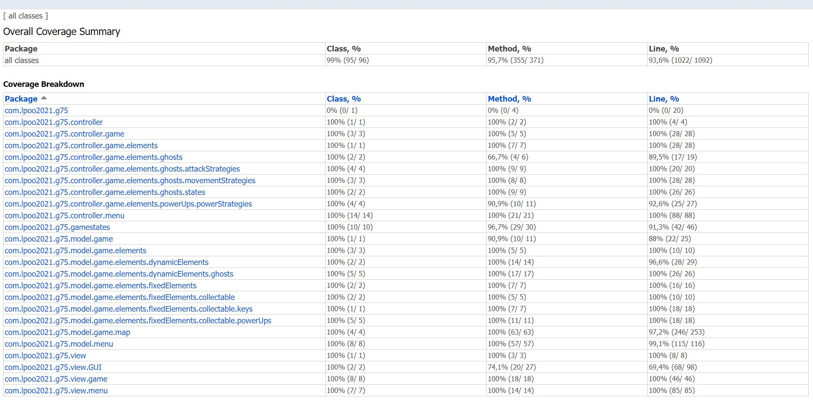

### 2. Unit Testing report

  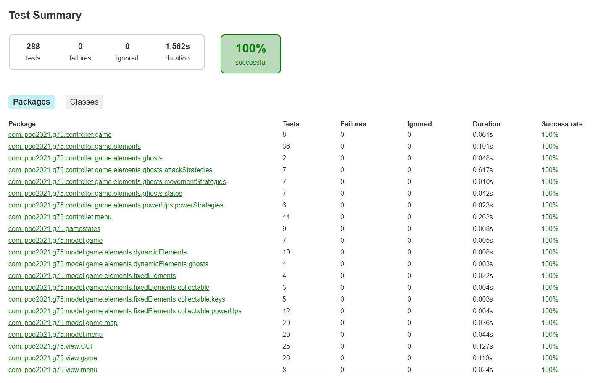

### 3. Mutation Test Report

  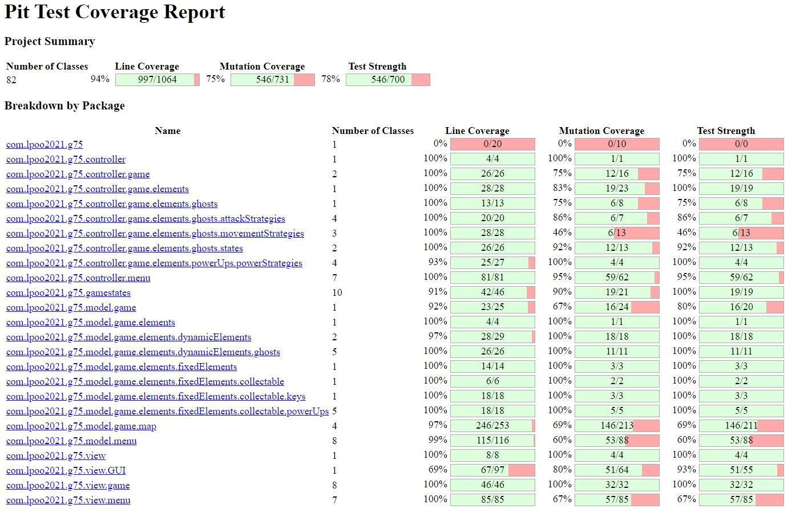

Foi usada a área de estudante no servidor de páginas.fe.up.pt para alojar os seguintes *reports*.

>[Link](https://paginas.fe.up.pt/~up201905427/lpoo/coverage/index.html) to Coverage report

>[Link](https://paginas.fe.up.pt/~up201905427/lpoo/pitest/202105291524/index.html) to Mutation testing report

***

## Self-Evaluation

Tendo em conta a divisão do projeto e empenho dos diferentes elementos do grupo ao longo do desenvolvimento do mesmo nas diferentes fases de entrega e implementação, o grupo concordou na seguinte divisão:

 - Marta Mariz: 27%
 - Patrícia Oliveira: 46%
 - Telmo Botelho: 27%

 Para verificar melhor o esforço dedicado por cada elemento é possível verificar o número de *commits* realizados por cada elemento e a sua contribuição em concreto.
